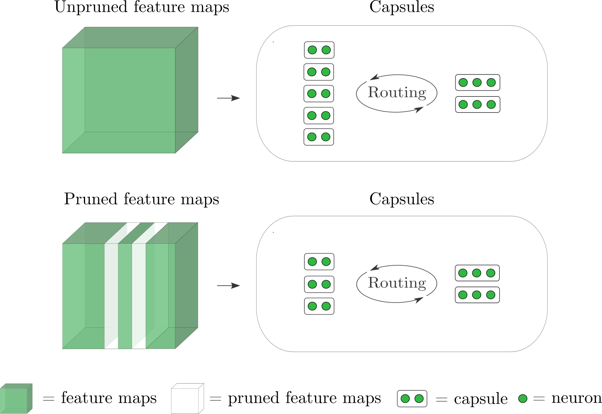

# **Towards Efficient Capsule Networks**

PyTorch implementation for *[Towards Efficient Capsule Networks](https://arxiv.org/abs/2208.09203)*

Accepted at [ICIP 2022](https://2022.ieeeicip.org/), Special Session [SCENA](https://scena.wp.imt.fr/)

**Abstract**: From the moment Neural Networks dominated the scene for image processing, the computational complexity needed to solve the targeted tasks skyrocketed: against such an unsustainable trend, many strategies have been developed, ambitiously targeting performance's preservation. Promoting sparse topologies, for example, allows the deployment of deep neural networks models on embedded resource-constrained devices. 
Recently, Capsule Networks were introduced to enhance explainability of a model, where each capsule is an explicit representation of an object or its parts. 
These models show promising results on toy datasets, but their low scalability prevents deployment on more complex tasks. 
In this work, we explore sparsity besides capsule representations to improve their computational efficiency by reducing the number of capsules. We show how pruning with Capsule Network achieves high generalization with less memory requirements, computational effort, and inference and training time. 

<div style="text-align: center">
<p align="center">
  
</p>
</div>

## Getting Started

### Setup Runtime Environment

**Via Pip/Conda**

```
pip install -r requirements.txt
```

**Via Docker**

ToDO

### Setup Weights & Biases
This repository uses Weight & Biases for experiment tracking. Set your account's project and entity names in the `src/wandb_project.json` file.

To create a Weight & Biases account see [(creating a weights and biases account)](https://app.wandb.ai/login?signup=true) and the associated [quickstart guide](https://docs.wandb.com/quickstart).

### Download Tiny-ImageNet
If you want to train the networks on Tiny ImageNet, download the dataset from [Google Drive](https://drive.google.com/file/d/1wy3FB1mbha1n8F1Or_85JKS_AQKPWBOh/view?usp=sharing) and unzip in the `data/tiny-imagenet-200` folder 

### Download backbones pruned with EagleEye
Download checkpoints from EagleEye [Google Drive](https://drive.google.com/drive/folders/1ENq4RuFey3J2iL-Lu1BZ9ToTYILpV9bC) and put them in the `dump/models/EagleEye/` folder

### Training

Configuration files are stored in the in the `src/configs/` folder.
For example, to finetune a CapsNet with a ResNet50 backbone with 25% of remaining FLOPs on cifar10 run

```
cd src/
python main.py --config configs/resnet50/cifar10/resnet50_flops25_cifar10_structured_finetuning.json --output wandb_runs.csv
```

or with the backbone freezed

```
python main.py --config configs/resnet50/cifar10/resnet50_flops25_cifar10_structured_freeze.json --output wandb_runs.csv
```

More arguments can be found in the corresponding config json files.

### Results
Once you trained all the networks, you can see the results running
```
python results.py --wandb_runs wandb_runs.csv
```

### Citation
Use this bibtex if you enjoyed this repository and you want to cite it:

```
@misc{renzulliICIP22,
  doi = {10.48550/ARXIV.2208.09203},
  url = {https://arxiv.org/abs/2208.09203},
  author = {Renzulli, Riccardo and Grangetto, Marco},
  keywords = {Computer Vision and Pattern Recognition (cs.CV), FOS: Computer and information sciences, FOS: Computer and information sciences},
  title = {Towards Efficient Capsule Networks},
  publisher = {arXiv},
  year = {2022},
  copyright = {Creative Commons Attribution 4.0 International}
}
```

ICIP bibtex coming soon!

This code is based on the [EagleEye](https://github.com/anonymous47823493/EagleEye/) implementation

Contact: riccardo.renzulli@edu.unito.it
